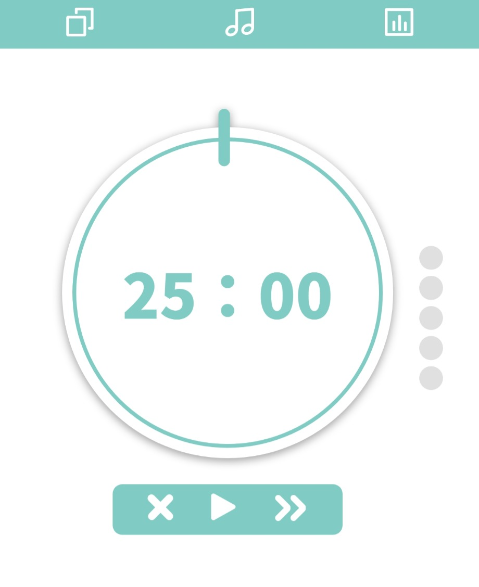
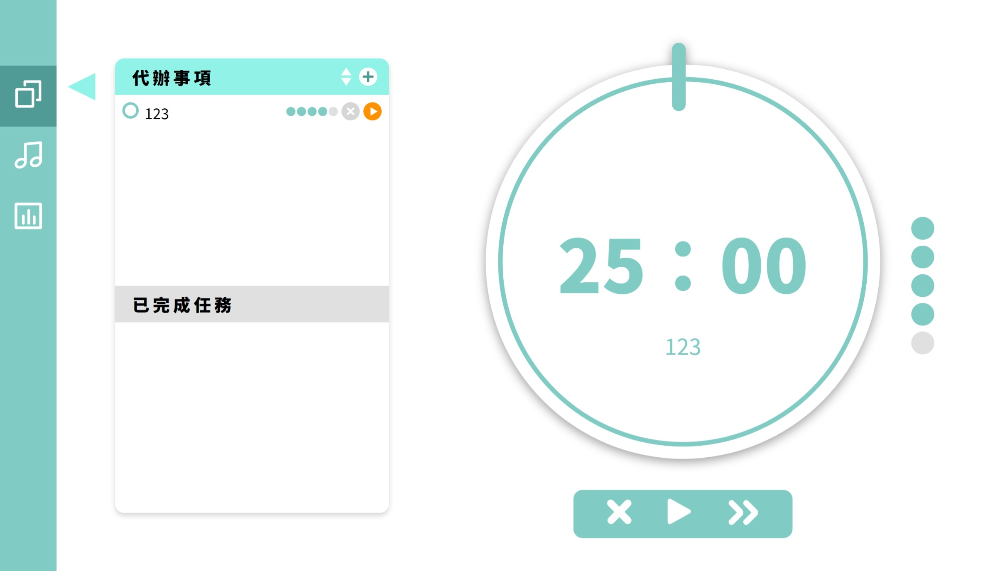

# React Pomodoro 番茄鐘
《THE F2E 前端精神時光屋 2nd》的番茄鐘   
使用 React + styled-components + Redux toolkit 建構 SPA 網頁  

🎨[設計稿來源 - Amber](https://challenge.thef2e.com/user/1412?schedule=2630#works-2630)     
👉[網頁 DEMO](https://meitung473.github.io/React-Pomodoro/)  


## DEMO
-   mobile

-   desktop


> 原本的設計稿並沒有 mobile 版，因此我自主調整了一些畫面。
## 核心功能
-   新增、排序、編輯任務項目
-   指定任務的番茄數 (循環)
-   跳過任務/休息時間
-   取消目前任務
-   選擇任務/休息鈴聲種類
-   關閉/開啟鈴聲
-   查看當週的使用狀況
-   儲存目前的紀錄
-   支援 RWD 瀏覽、PWA 應用下載

## 說明
**使用技術 :**
- React Hooks
- react-router-dom : HashRouter 建立路由，製作 SPA
- Redux/Redux toolkit : 管理跨頁 state ，搭配 localStorge API 暫存番茄鐘的資料
- styled-components :  以 JSX 語法撰寫 CSS 樣式
- react-chartjs-2.js : 客製化表格，調整顯示的資料與表格樣式
- moment.js : 搭配 react-chartjs-2 調整時間顯示的格式
- uuid 套件，使用 v4 用來產生不重複的 todoId
- react-app-rewired : 以不 eject 的方式調整 webpack 設定，應用在 resolve 調整路徑
- Prop-Types : 型別檢查
- ESLint、Prettier 套件檢查語法，統一 coding style 與排版的整潔

**其他 :**
- 多個 custom Hooks :
  - useMediaQuery : 透過 JS 實現 RWD 瀏覽，在不同裝置上顯示不同元件
  - useInterval : 參考 [Dan 大的文章](https://overreacted.io/making-setinterval-declarative-with-react-hooks/)，實作彈性一點的 setTimeout 
  - useClock : 計時器中的重置與任務/休息狀態輪替，並利用 Context API 讓不同分頁的元件共用
  - useModal : 彈跳視窗的顯示與種類
- React Design Pattern ─ compound components : 使用複合式元件，提升元件的重複性與可擴充性。
- generateSound.js : 使用 node filesystem 收集鈴聲的路徑與名稱，不用手動添加 path

## TODO
- [ ] PWA : 跳小窗通知功能。ex : 時間到顯示視窗
- [ ] React DnD : 將點擊排序改成更彈性的拖曳功能
- [ ] Blog 文章 : 撰寫過程紀錄紀錄
## 資料夾結構
```bash
+---components
|   +---Alarmoption
|   +---AnalysisTable
|   +---Chart
|   +---CheckButton
|   +---Clock
|   +---Header
|   +---Modal
|   |   \---modals
|   +---OrderButton
|   +---Page
|   +---Timer
|   +---Todo
|   \---TomatoCount
+---constants
+---data
+---format
+---Hooks
+---images
+---pages
|   +---AlarmPage
|   +---AnalysisPage
|   \---TodoPage
\---redux
    \---reducers
        +---alarm
        +---chart
        +---timer
        \---todo
```

## Function Map
F2E 挑戰指定的功能  

- [x] 待辦事項
	- [x] 設定待辦事項名稱或內容  
	- [x] 設定待辦事項成已完成狀態  
	- [x] 調整排列順序  
	- [x] 蕃茄鐘  
- [x] 固定時間區間  
	- [x] 主工作時間：25 分鐘  
	- [x] 短休息時間：5 分鐘  
- [x] 時間倒數介面   
	- [x] 顯示進行中待辦事項  
	- [x] 有開始鍵能啟動倒數  
	- [x] 能暫停倒數   
	- [x] 能略過倒數  
	- [x] 顯示倒數時間  
	- [x] 提示鈴聲選項  
- [x] 狀態報表  
	- [x] 當天使用蕃茄鐘的記錄與成效  
	- [x] 當週使用蕃茄鐘的記錄與成效   

## 參考資料
### 基礎功能
1. 正確的倒數計時(?) : [How to write a countdown timer in JavaScript? - Stack Overflow](https://stackoverflow.com/questions/20618355/how-to-write-a-countdown-timer-in-javascript)  
   - 回答提到如果是跟真實時間有關的倒數計時，可以使用 cookies 的 expire 來計算，因為 setTimeout 會有誤差。
2. React 中的計時器 : [Making setInterval Declarative with React Hooks ](https://overreacted.io/making-setinterval-declarative-with-react-hooks/)
3. 陣列中如何交換元素 : [js陣列內元素快速交換位置 | 瓦哈拉圖書館](https://blog.desmondsylin.com/2020/12/11/fast-change-array-position-in-js/)。👉[MDN 參考](https://developer.mozilla.org/en-US/docs/Web/JavaScript/Reference/Operators/Destructuring_assignment#array_destructuring)
   - 交換元素也可以使用 `splice`
	```js
		const arr = ['one','two','three'];
		// 把 index : 0 代替成 從 splice 移除去的元素，並填加上 'one' 這個元素在移除的 index 位置
		arr[0] = arr.splice(2,1,'one')[0]
		console.log(arr)//["three","two","one"]
	```
   - ES6 解構的方式 : 
	```js
		const arr = ['one','two','three'];  
		[arr[0],arr[2]] =[arr[2],arr[0]];  	
		console.log(arr);//['three','two','one']
	```
	- function
	```js
		const arr = ['one','two','three'];  
		function swap(a,b){
			let temp = arr[b]
			arr[b] = arr[a]
			arr[a] = temp
		}
		swap(0,2)
		console.log(arr);//['three','two','one']
	```
### Redux
1. Redux + localStorage 教學影片 : [Redux: Refactoring the Entry Point | egghead.io](https://egghead.io/lessons/javascript-redux-refactoring-the-entry-point)
2. 監聽改變就儲存目前狀態 : [javascript - Where to write to localStorage in a Redux app? - Stack Overflow](https://stackoverflow.com/questions/35305661/where-to-write-to-localstorage-in-a-redux-app)

### CSS 樣式方面
1. 客製化卷軸 : [Custom Scrollbars in WebKit | CSS-Tricks](https://css-tricks.com/custom-scrollbars-in-webkit/)
2. 進度條 SVG 的動畫 : [Building a Progress Ring, Quickly | CSS-Tricks](https://css-tricks.com/building-progress-ring-quickly/)
   - stroke-offset : 分段的起始點，如果 stroke-dasharray 沒有設定就不會有效果。
   - stroke-dasharray : `stroke-dasharray : 10 10`，代表把線段切成 10 段，每個線段間距為 10 px。越靠近 0 越靠近原本圖形(代表沒切)
3. styled-components 迴圈產生 css : [javascript - @for loops in styled-components](https://stackoverflow.com/questions/52696511/for-loops-in-styled-components)

### Chart.js + Moment.js
1. 改變 Chart.js 預設的背景顏色與顏色範圍 : beforeDraw 
   - [javascript - Chart js doughnut box shadow - Stack Overflow](https://stackoverflow.com/questions/45029660/chart-js-doughnut-box-shadow)
3. moment.js : 作為 Chart.js 的 adapter，調整本地化
   - [moment.js - 關於時間的一切 ](https://ithelp.ithome.com.tw/articles/10208995) 
4. 時間單位的 x 軸出現問題
   
   - 時間線對不上 x 軸的點
   - 時間起始點是被四捨五入後的時間。例 : 今天 19 號，起始 x 卻是 20 號
   - 解決問題 :
      1. 設定 x 軸的 time property : [Time Cartesian Axis](https://www.chartjs.org/docs/latest/axes/cartesian/time.html#time-axis-specific-options)
      2. `round` : 預設是 false 。有定義的情況下，對現在的時間點開始的以後進行四捨五入。單位根據: [Time Cartesian Axis - time-units](https://www.chartjs.org/docs/latest/axes/cartesian/time.html#time-units)  
      3. 表格 x 軸顯示一天天的，從 day 開始，[校正時間軸](https://github.com/chartjs/Chart.js/issues/7249#issuecomment-663781695)
       ```javascript
       x: {
       	type: "time",
       	time: {
       		unit: "day",
       		// x 軸顯示的文字格式
       		displayFormats: {
       				day: "MMM Do",
       		},
       		// tooltip 上的時間格式
       		tooltipFormat: "MMM Do",
       		round: "day",
       	},
       }
       ```

### Webpack
1. react-rewired 覆蓋 webpack 設定，調整路徑 : [在 Create React App 中修改 Webpack 設定，以調整 Webpack Alias 為例 | by Harry Xie](https://snh90100.medium.com/%E5%9C%A8-create-react-app-%E4%B8%AD%E4%BF%AE%E6%94%B9-webpack-%E8%A8%AD%E5%AE%9A-%E4%BB%A5%E8%AA%BF%E6%95%B4-webpack-alias-%E7%82%BA%E4%BE%8B-59fd9eeeffe7)
